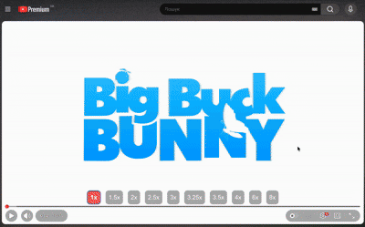

# Video Speed Controller

A browser extension for changing video playback speed with a single click — directly inside the video player.

## Why I built it

Most video speed controller extensions add unnecessary interaction.

Changing playback speed usually means opening a menu, finding the speed control, selecting an option, and then returning to the video.

I wanted the action I use constantly to require **one click**.

The extension adds a lightweight speed-control overlay directly to the video player. It behaves similarly to native player controls: it appears when the user interacts with the player and disappears when it is no longer needed.

No popup. No nested menus. No interruption of the viewing flow.

## Features

- **One-click playback speed switching**
- Customizable speed presets
- Speeds beyond the limits of the native YouTube controls
- Controls integrated directly into the video player
- Automatically hides together with the player UI
- Reappears on mouse interaction
- Configurable keyboard shortcuts
- Persistent user settings
- Support for video players on additional websites
- Works with dynamically created and updated video elements

## Technical highlights

The extension is intentionally small from a product perspective, but it deals with several interesting browser-platform problems.

### Web Components & Shadow DOM

Modern websites frequently encapsulate UI inside Web Components and Shadow DOM. The extension traverses these boundaries to discover and interact with video elements that would not be reachable through simple DOM queries.

### Dynamic DOM observation

Video players are often created, replaced, or modified after the initial page load.

The extension uses `MutationObserver` to detect these changes and attach controls dynamically without requiring a page reload.

### Player lifecycle handling

Controls are synchronized with player interaction and playback state rather than existing as a permanently visible extension UI.

This keeps the experience close to the behavior of native video controls.

### Persistent configuration

Custom playback speeds, keyboard shortcuts, and site configuration are persisted using browser extension storage.

### Multi-site architecture

Although YouTube was the original use case, the implementation is designed to support additional websites and different player structures.

## Product philosophy

The project follows a simple principle:

> Frequently used actions should require as little interaction as possible.

Instead of building another extension popup, the control is placed at the point where the action happens — inside the video experience itself.

The result is a small tool that I use every day.

## Status

The extension is fully functional and used daily in my own browser.

It has not yet been published to a browser extension store.

The settings UI is currently being redesigned before a public release.

## Tech

JavaScript · Browser Extensions API · Web Components · Shadow DOM · MutationObserver · Browser Storage · DOM APIs